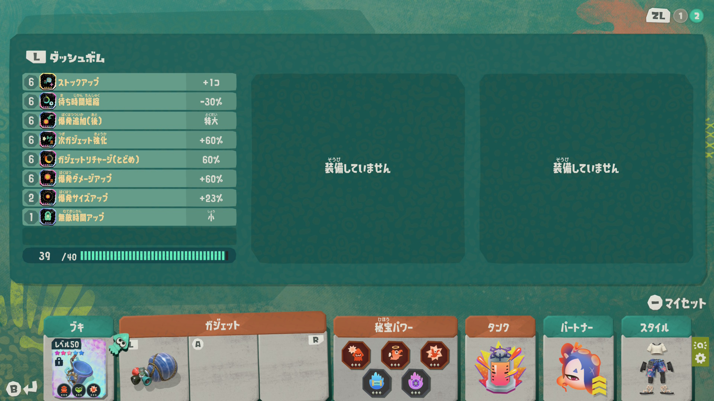

+++
date = "2026-09-07T00:00:00Z"
draft = false
title = "ダッシュボムのみで無限食堂を100階までクリアできるのか"
tags = ["ゲーム", "スプラトゥーン"]
+++

## はじめに
※本記事は趣味で書いた個人の感想であり、ネタバレの配慮などはありません。

筆者はスプラトゥーンが大好きなフデ使いだ。  
スプラトゥーンレイダースも予約購入し、フデ1本で無限食堂700階まで踏破した。  

より深層に潜れそうな手応えはあるが、レベルが50+350と低めのため、今は一旦中断してレベルカンストを目指しテンパラ遺跡を周回している。  


ただ、単調な周回も流石に飽きてくる。
その時ふと、ある縛りプレイが頭に浮かんだ。  

**1つのガジェットのみで無限食堂は100階までクリア可能なのか？**

## ガジェット格差問題
レイダースではガジェットの強さに大きな格差があり、無限食堂の深層ともなるとスピードタンク系ガジェットによる火力バフが必須級となる。  

これに対して「ビルドの選択肢が少なくて面白くない」という意見があるが、本編序盤から廃人向けエンドコンテンツにかけて、常に一貫してガジェットの格差が無いように調整するのはかなり難しいことではないだろうか。  

なら任天堂はどの進度までゲームバランスを保証しているのだろうか。筆者の予想となるが、無限食堂の100階までだろうと考えている。  
100階には図鑑埋めにも関わる裏ボスがいる。  
一部のガジェットではクリアが不可能、なんて調整にはしないだろう。  

裏を返せば、**無限食堂の100階まではどのガジェットでもクリア可能なのでは？なんなら、1つのガジェットのみでもクリア可能なのでは？？**

それなら試してみよう。  
無限食堂の100階までなら、どんなカジェットも輝けるはず。  

## レギュレーション
- 塗りも含めて**ブキの使用禁止**。
- 奥義の使用禁止。
- 装備する**ガジェットは1つ**。
- ガジェットパーツは自由。
- ブキパワーは自由。
- タンクは自由。
- 秘宝パワーは自由。
- 調査メカ関連の縛りは無し。

以上のルールで無限食堂の1階から100階までを目指す。

## 今回のビルド
記念すべき第1回目の挑戦はダッシュボムだ。  
いきなり最強格のガジェットでの挑戦となるが、他ガジェットは強化のためのウズシオクリスタルが足りないためご容赦いただきたい。

ビルドは以下の通り。

時間制限のある無限食堂では火力がものを言うため、火力UP系と回転率を重視した。

そして、最重要なのは**スピードマスターの秘宝パワー**だ。  
ブキの塗りを禁止しているため、タンクストリームが無いと移動さえままならない。  
火力源であるダッシュボムを移動用に利用するのは緊急時に絞りたい。

爆発のダメージが20万弱、爆発追加(後)によるダメージが22万強で火力は期待できそう。  
次ガジェット強化や爆発ダメージアップのガジェットパーツはもちろん、インファイトや発酵の恩恵も大きい。


## いざ実戦
### 1〜51階
一撃でオオモノを倒せるのでサクサク。  
爆発追加(後)も当てればダッシュボム1回分で粗挽きテッパンも倒せる。  
さらにガジェットリチャージ(トドメ)ですぐに次のダッシュボムが使用可能となるため、ガンガン連打できる。  
爆発と共にステージを駆け巡れてすげー楽しいぞこれ。

タンクストリームを切らしてしまっても、ダッシュボムで緊急回避できるのが扱いやすい。  
その後は塗られた地面で再度タンクストリームを発動すれば体制はかなり立て直せる。

ダッシュボムのクールタイムが短く、困った時はいつでも使えるのも評価点だ。



### 52階〜90階
少しずつシャケが硬くなり、タンシオやキワモノはダッシュボム1回分では倒せなくなってきた。  
51階以前とは異なり、多少考えながらプレイする必要がある。

さらに、54階に初期配置されているウデジマンから明らかに歯ごたえが出てきた。  
他のオオモノを巻き込んで倒すことでダッシュボムをリチャージしつつ、ウデジマンを削っていくのだが、なかなか倒れてくれない。  

ウデジマンのトング攻撃は喰らうとかなり手痛いダメージのため、ダッシュボムの無敵を合わせる必要がある。  
ウデジマンを軸にして右に左に駆ける様はもはや別ゲーだ。
俺がやっているのは本当にスプラトゥーンなのか？


ともあれ、ある程度時間の余裕を持ってクリアできた。まだまだ進めそうだ。

### 91階〜96階
ステージが黄金色になり、キワモノが必ず初期配置で現れるようになる。  
ここから明らかに難易度が上がってきた。

ステージが広い上に渦を巻いており、オオモノが律儀に道なりに近づいてくるものだから、寄るのに時間がかかる。  
そのため、キワモノに夢中になっていると他のオオモノを放置してしまい、イクラが足らなくなるのだ。

さらに、ハネツキやナベブタなどもダッシュボム1発分では倒せなくなっており、特にバクダンは的確に弱点を狙わないと2発分でも倒せない。  
段差やメカジャンプを使わないとダッシュボムを弱点に当てるのはシビアなため、意識しないと盤面が悪くなる。

倒す順番も考えないと失敗してしまいそうだ。

### ついに、97階〜99階
ついにここまでやってきた。  
100階の裏ボスは制限時間が無いため、ここが最難関だろう。  

これまで何度かデスはしたものの(主にダッシュによる水没)、オタカラハント失敗は1度も無い。  
このままノーミスでクリアしてしまいたい。

97階のW粗挽きテッパンは難なくクリア。  
98階のWバリカタカタパは、トルネの回避が大変すぎる&攻撃を当てにくすぎると面倒極まりなかったが、1秒残しで辛くもクリア。

ついに99階のWウデジマン戦。


早々に右手のスモーカーを処理し、下側のウデジマンと交戦。  
トングにダッシュボムの無敵を合わせながら戦うが、側にいるバクダンと上側のウデジマンの援護がひたすら鬱陶しい。  
1デスしながらなんとか1体目のウデジマンを撃破するものの、残り時間は約30秒。
あれ？これ間に合わなくない？

ステージ中腹まで降りてきた2体目のウデジマンと交戦するが、通路が細くて戦いづらい！！  
そのまま時間切れとなり、オタカラハント失敗…。  

やはりダッシュボムのみでは無理なのか？

### 敗因を踏まえ再戦
何度か試したが、ウデジマン1体を50秒以内で倒すのはなかなか難しい。

周りに倒しやすいオオモノや雑魚シャケが多く湧いてくれれば、ガジェットリチャージ(とどめ)やガジェットブースト(とどめ)が発動してダッシュボムの回転率は高くなるが、運の要素が大きい。  
その上、そもそも上側のウデジマンとは細い通路で戦うため他のシャケを巻き込めない。

上側のウデジマンをイカロールで落とすことも考えた。  
しかし、冷凍もガジェットによるタンク技発動も使えないため、上側のウデジマンまでたどり着く→塗りを作って潜伏→タンクストリームを発動してイカロールで落とすの一連の流れを素早く行うのが難しい。

少し方法を詰めていけばイカロール落としも現実的とは思うが、今回は別のアプローチを取ることにした。  
上側のウデジマンを完全に無視することだ。

ダッシュボムの移動や無敵でメガホンやスピナーはある程度やり過ごせるため、上側のウデジマンには見向きもせずイクラを集めきってしまおうという作戦だ。

ビルドも見直してみたが、結局変更はせずに再戦。  

結果は…**14秒残しでクリア！！**


最初から2体目のウデジマンは無視すると割り切っていたため、他のオオモノに集中できた。  
やはり、倒しやすいオオモノを優先して倒し、どんどん新たなオオモノを沸かせるのが最善なのかもしれない。

### 100階
もはやエキシビションマッチだ。  
シオヅケノオオミカミは確かに強敵だが、制限時間が無ければいくらでもやりようはある。

実際に難なくクリア。ウデジマン2体と比べたら敵ではない。


## 感想
見切り発車で始めた縛りプレイだが、予想以上にダッシュボムの火力が高く、本当に100階まで行けてしまった。  
火力を盛れば1発で40万越えのダメージを叩き出せるんか…。

クールタイムの短さをイカし、ステージを縦横無尽に駆けるのも面白かった。  
他ビルドではできない体験なので気が向けば試してほしい。

## 今回の検証結果
ダッシュボムのみで無限食堂を100階までクリアできる。
